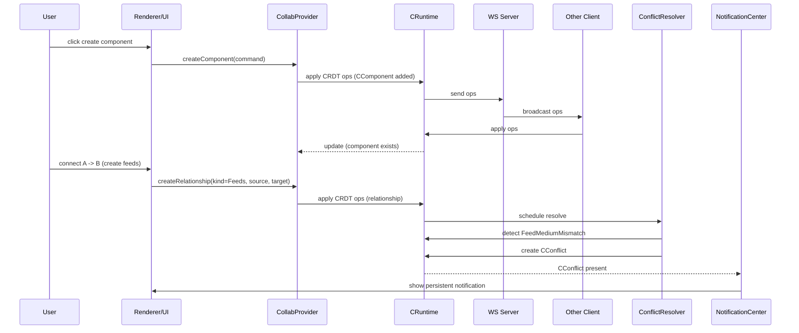

# Architecture Diagrams

## Static Architecture (components)

```mermaid
graph TD
  subgraph App[Desktop App]
    Renderer[Electron Renderer (React + React Flow)]
    Main[Electron Main]
  end

  subgraph Frontend
    Renderer --> CollabProvider[CollabProvider]
    CollabProvider --> CRuntime[CRuntime (@collabs)]
    Renderer --> UI[GraphCanvas / AttributesSidebar / NotificationCenter]
  end

  subgraph Network
    CRuntime --> WSClient[@collabs/ws-client]
    WSClient --> WSServer[@collabs/ws-server]
    WSServer --> OtherClients[(Other Clients)]
  end

  subgraph Model
    CEngineeringGraph[CEngineeringGraph]
    CComponent[CComponent / CEquipment / CPort]
    CRelationship[CRelationship]
    CConflict[CConflict]
  end

  CollabProvider --> CEngineeringGraph
  CEngineeringGraph --> CComponent
  CEngineeringGraph --> CRelationship
  CEngineeringGraph --> CConflict
```

## Dynamic Architecture (sequence: create component → connect → conflict)



Notes:
- Sequence shows the optimistic CRDT write model (writes applied locally and replicated), and a later semantics pass (resolver) that may create authoritative conflict records which drive UI notifications.

```
